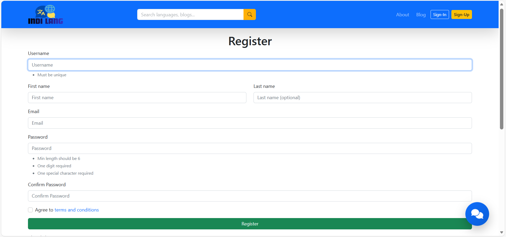
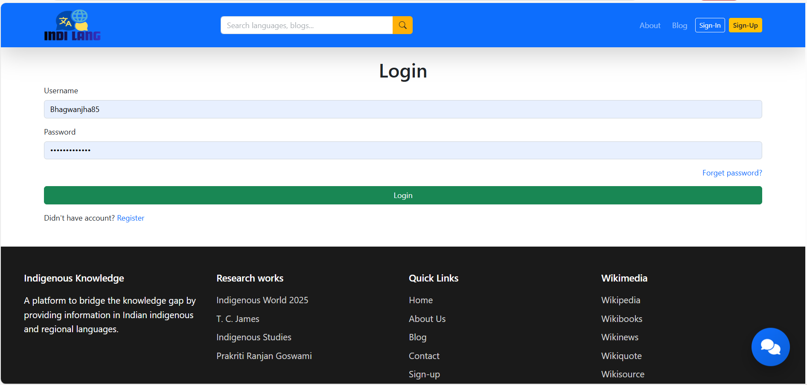
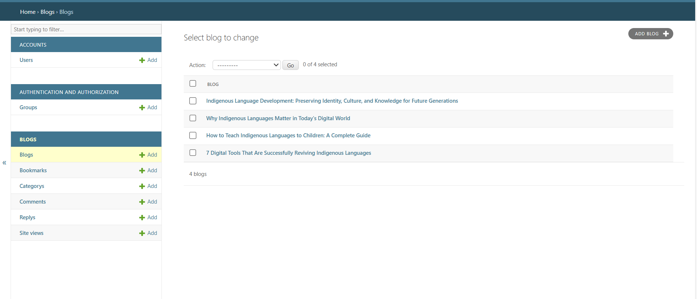
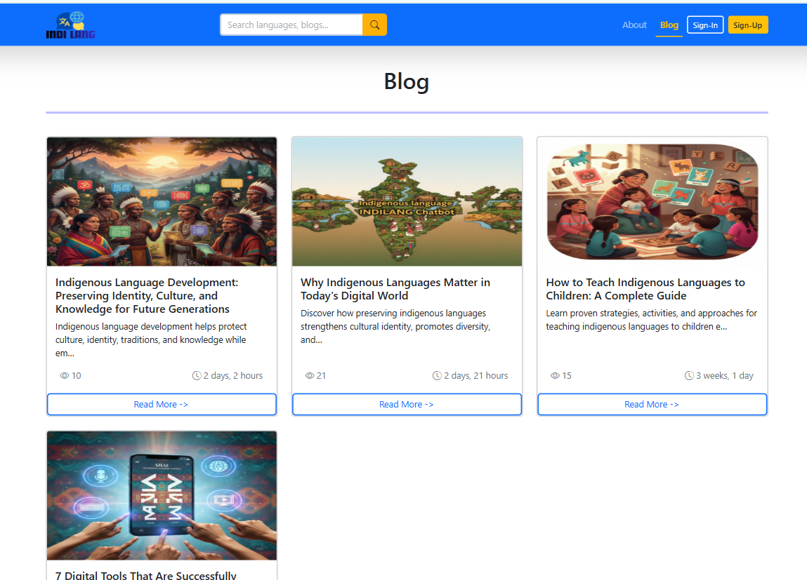
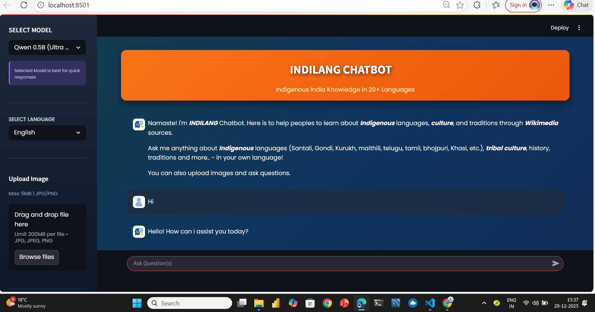

# **Indigenous Knowledge Bridger**

<p align="center">
  
</p>

---

<p align="center">
  <b> Full-stack Platform for helping Indigenous Languages Knowledge, Culture & Language</b>
</p>
<p align="center">
  
  
  
  
</p>

---

##  About the Project

A **full-stack AI-powered web platform** designed to preserve, explore and communicate Indigenous knowledge, culture, language and 
heritage using modern web technologies and multiple large language models (LLM). 

The project integrates open source + proprietary AI models, real-time APIs and a structured content system 
(detailed blog page, admin panel for add/update/delete blogs, chatbot integrated and differents pages) to deliver highly accurate cultural responses, where Olama (the QWEN model)
performed best for chatbot responses..

##  Features

*  **Login & Signup System**
*  **AI Chatbot (Multi‑Model Integration)**
*  **Blog Section (Admin‑Controlled)**
*  **Admin Dashboard**
*  **About Us, Privacy Policy, terms and conditions, contact Page**
*  **Wikipedia API Integration**
*  **Local + Cloud AI Models**
*  **High‑Accuracy Cultural Responses**

---

<p>
  
    
    
    
    
    

</p>

##  How It Works

1. User ask query to chatbot 
2. Query is routed to a AI model
3. Wikipedia API and Ollama (Qwen 0.5B , Qwen1B) fetches verified factual data
4. Best response selected on the basis of:
   * Accuracy
   * Context relevance
   * Cultural Sensitivity
5. Final response delivered to the user
6. Admin monitors content & usage

---

##  Technology Stack

### Frontend

* HTML5
* CSS3
* JavaScript
* Bootstrap & Tailwind CSS
* Streamlit for Chatbot
  
### Backend

* Python (Django)
* Front-end and Back-end Integration

### Database

* SQLite 

### AI & APIs

* **Ollama (Qwen Models – Local LLM)**
* Google Gemini API (Limited)
* Hugging Face Models
* Groq API (Limited)
* Wikipedia API (Public API)

### Tools

* GitHub
* Ollama
* Official Documentations
  
---

## AI Models Comparison

| Platform      | Model            | Type                | Accuracy | Speed | Cost      | Overall Result      |
| ------------- | ---------------- | ------------------- | -------- | ----- | --------- | ------------------- |
| **Ollama**    | Qwen             | Open‑Source (Local) | ⭐⭐⭐⭐⭐    | ⭐⭐⭐⭐  | Free      | Best Performance |
| Google Gemini | gemini‑1.5‑pro   | Proprietary         | ⭐⭐⭐⭐     | ⭐⭐⭐⭐   | Paid      | Strong reasoning    |
| Google Gemini | gemini‑1.5‑flash | Proprietary         | ⭐⭐⭐⭐      | ⭐⭐⭐⭐⭐ | Paid      | Accurate, Fast, depth    |
| Hugging Face  | Multiple Models  | Open‑Source         | ⭐⭐⭐      | ⭐⭐⭐   | Free/Paid    | Model‑dependent     |
| Groq          | LPU Models       | Proprietary         | ⭐⭐⭐⭐     | ⭐⭐⭐⭐⭐ | Paid      | Ultra‑fast          |
| Wikipedia API | –                | Knowledge API       | ⭐⭐⭐     | ⭐⭐⭐⭐  | Free      | Reliable facts but not vary accurate      |

---

## Best Model: Ollama (Qwen)

**Why Ollama performed best:**

* Local inference (no latency)
* No API rate limits
* High cultural & linguistic relevance
* Works offline
* Cost‑effective


##  Installation & Setup

### 1️. Clone Repository

```bash
git clone https://github.com/Bhagwanjha85/indigenous-knowledge-bridge.git
cd indigenous-knowledge-bridge
```

### 2️. Install Dependencies

```bash
pip install -r requirements.txt
```

### 3️. Environment Variables

Create a `.env` file:

```env
GEMINI_API_KEY=your_key
GROQ_API_KEY=your_key
HUGGINGFACE_API_KEY=your_key
```

### 4️. Install Ollama & Model

```bash
ollama pull qwen
ollama run qwen
```

### 5️. Run Project

```bash
ollama serve
python manage.py runserver
# And
streamlit run app.py

⚡Run both manage.py and streamlit chatbot in separate terminals./ If you want to access chatbot on website than run only manage.py.
```

---

##  Security & Privacy

* Secure authentication
* Environment‑based API keys
* Clear privacy policy
* Admin‑controlled content

---

##  Use Cases

* Indigenous language preservation
* Cultural education platforms
* Academic research
* Community knowledge sharing
* AI‑based learning tools

---

##  Conclusion

This project proves that **open‑source local LLMs (Ollama)** can outperform proprietary models for **domain‑specific cultural knowledge**.

**Key Insights:**

* Multi‑model AI improves reliability
* Local LLMs are cost‑effective & accurate
* Cultural AI requires contextual understanding

---

## Future Enhancements

* Indigenous language fine‑tuned models
* Voice‑based chatbot
* Mobile app version
* User‑verified content system
* AI moderation layer


---
##  Acknowledgements

Special thanks to **IIIT Hyderabad - IndicWiki Project**  
(@indicwiki-iiit) for providing inspiration for this project.

The idea of ​​the *Indigenous Knowledge Bridge* was inspired during my internship with the **IndicWiki Initiative at IIIT Hyderabad**, which focuses on preserving and promoting Indian languages, culture, ​​and indigenous knowledge.


##  License

MIT License

---

## 👤 Author

**Bhagwan Ji Jha**
 Tech Innovator

---

⭐ *If you like this project, don’t forget to star the repository!*
